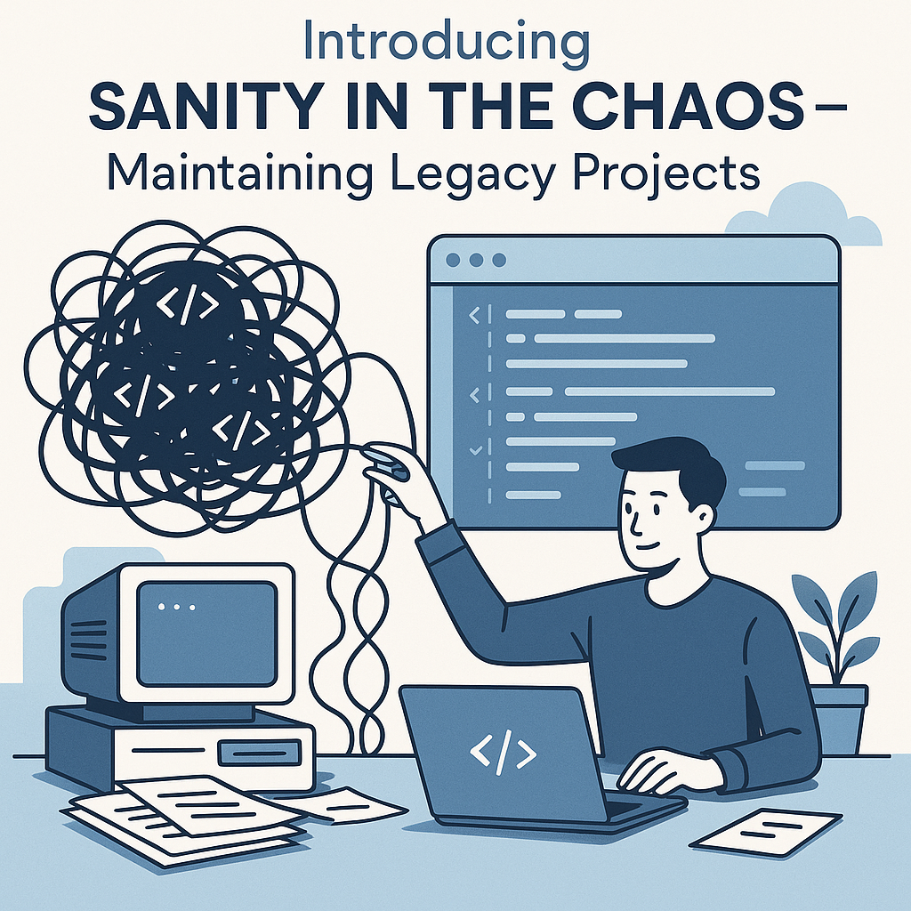

[[toc]]

After years in software engineering, I’ve realized that working with legacy projects is far more common than starting from scratch. Some of my toughest challenges have come from inheriting old codebases — like a PHP project from the early 2000s, where PHP 4, HTML, and CSS were all tangled together in single files.

It’s tempting to think a full rewrite is the answer. I’ve made that mistake myself, only to find it leads to even more maintenance headaches. Now, my approach is to first introduce order and stability to the existing project before considering any major refactoring.

## The Temptation to Rewrite (and Why It Fails)

When most developers encounter a legacy codebase, the first instinct is often to rewrite everything from scratch. It feels cleaner, more modern, and promises a fresh start. However, rewrites are notorious for becoming painful, drawn-out processes that rarely deliver the expected results. You risk introducing new bugs, losing critical business logic, and spending months (or years) before reaching feature parity. Instead, the smarter approach is to bring order and sanity to the existing chaos—one step at a time.

## Steps to Bring Sanity to Legacy Projects

### 1. Standardize the Database Structure

Legacy projects often have inconsistent or undocumented database schemas. The first step is to bring the database under version control using migrations:
- **Laravel**: Use built-in migrations to define and evolve your schema.
- **Node.js**: Tools like [Knex.js](https://knexjs.org/) provide a migration system.
- **Go**: [Goose](https://github.com/pressly/goose) is a popular choice for managing migrations.

This ensures every team member and environment is in sync, and changes are traceable.

### 2. Enforce Consistent Code Formatting

Often times, I've been in codebases where every developer has their own coding style. When starting is not a big problem, however in large codebases, this becomes a maintenance hell. Little things like variable casing, multiline or single line function definitions among others can really build up into a big code frustration.

Inconsistent code style makes legacy code harder to read and maintain. Introduce automated formatters and linters:
- **PHP**: [PHPCS](https://github.com/squizlabs/PHP_CodeSniffer), [Laravel Pint](https://laravel.com/docs/10.x/pint)
- **Node.js**: [Prettier](https://prettier.io/), [ESLint](https://eslint.org/), or [Biome](https://biomejs.dev/)
- **Go**: The language comes with [gofmt](https://pkg.go.dev/cmd/gofmt) out of the box

> [!IMPORTANT]
> On the first run, it can very daunting when you see all the style errors across the codebase, you don't have to tackle all of this at once, it will be a big risk to even push this in production.
>
> Take a breathe, we can use baseline files to capture all existing errors and get a clean slate for our CI pipes, then gradually fix errors in the existing codebases. You can also target specific directories in configuration and expand it to include more codebases.

### 3. Add Automated Unit & Feature Tests

Legacy code is risky to change without tests. Start by writing unit and feature tests around the most critical business rules. Don’t aim for 100% coverage immediately—focus on the areas that matter most. Over time, expand your test suite to cover more ground.

### 4. Integrate CI for Code Reviews

Set up Continuous Integration (CI) to run your tests, linters, and formatters on every pull request. This enforces your new standards and prevents regressions from slipping through code reviews.

Modern CI tools like [GitHub Actions](https://github.com/features/actions) and [CircleCI](https://circleci.com/) make life a bit easier by providing robust automation for your workflows.

### 5. Fix Regressions with Regression Tests

As you fix bugs or regressions, write [regression tests](https://github.com/resources/articles/software-development/regression-testing-definition-types-and-tools) to lock in the fixes. This builds confidence and stability, especially when refactoring or cleaning up code.

> [!NOTE]
> This is personally my favorite type of tests. Making sure my regression test fails, then fixing the bug to make the test pass really builds confidence in the code base.

### 6. Get Rid of Dead Code
Dead code—unused functions, variables, or entire modules—clutters legacy projects and makes maintenance harder. Use static analysis and automated refactoring tools to detect and safely remove dead code:

- **PHP**: [RectorPHP](https://github.com/rectorphp/rector) can automatically refactor and remove dead code. [PHPStan](https://phpstan.org/) and [Psalm](https://psalm.dev/) also help identify unused code.
- **Node.js**: [ts-prune](https://github.com/nadeesha/ts-prune) finds unused TypeScript exports. [depcheck](https://github.com/depcheck/depcheck) detects unused npm dependencies.
- **Go**: The built-in `go vet` and `go tool unused` (via [unused](https://github.com/dominikh/go-tools/tree/master/cmd/unused)) can highlight unused code.

Regularly running these tools helps keep your codebase lean and easier to understand.

## Now, Refactor—But Keep It Simple

With tests in place, you can safely refactor the codebase. Use your tests as a safety net and avoid overcomplicating the architecture. Stick to the KISS principle (Keep It Simple, Stupid). Incremental improvements are more sustainable than big-bang rewrites.

## Standardize the Development Environment

Legacy projects often suffer from “it works on my machine” issues. Use tools like Docker to standardize the development environment, ensuring everyone runs the same stack regardless of OS or local setup.

## [BONUS] Static Analysis

After achieving some sanity, you can then opt for introducing static analysis tools in the codebase that can get rid of lots of errors and potential runtime errors that unit tests might not capture. In PHP, we have PHPStan or LaraStan. I'm sure there will be similar tools in the NodeJS environment. For Golang, due to it's strong typing and compilation nature, it comes with some static analysis baked in.

---

By following these steps, you can gradually bring sanity to even the messiest legacy projects—without the pain of a full rewrite. Focus on consistency, automation, and incremental progress, and you’ll be surprised how manageable legacy code can become.

